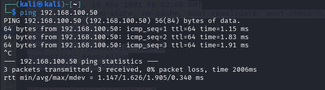
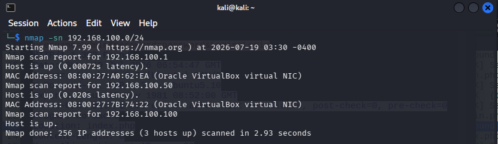
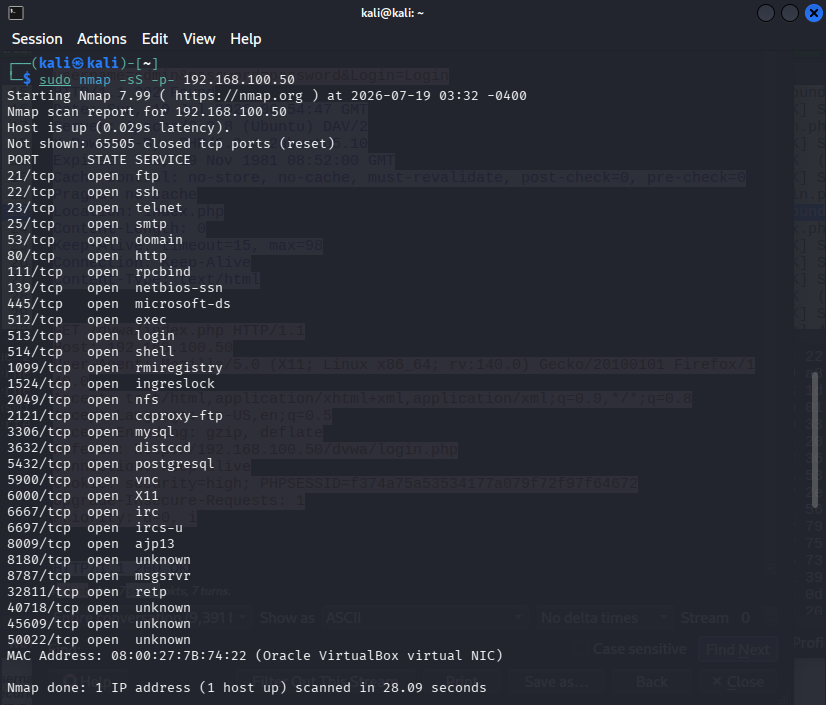
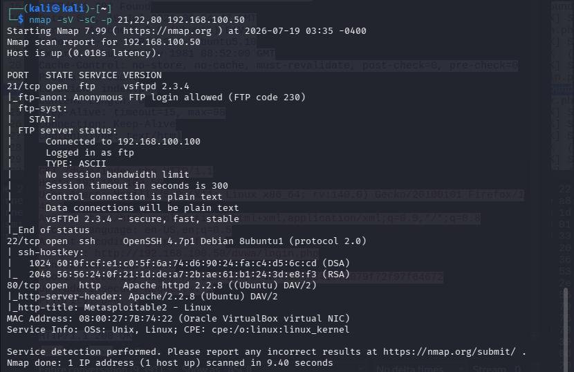
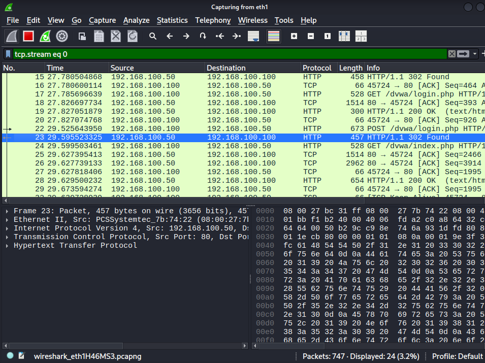
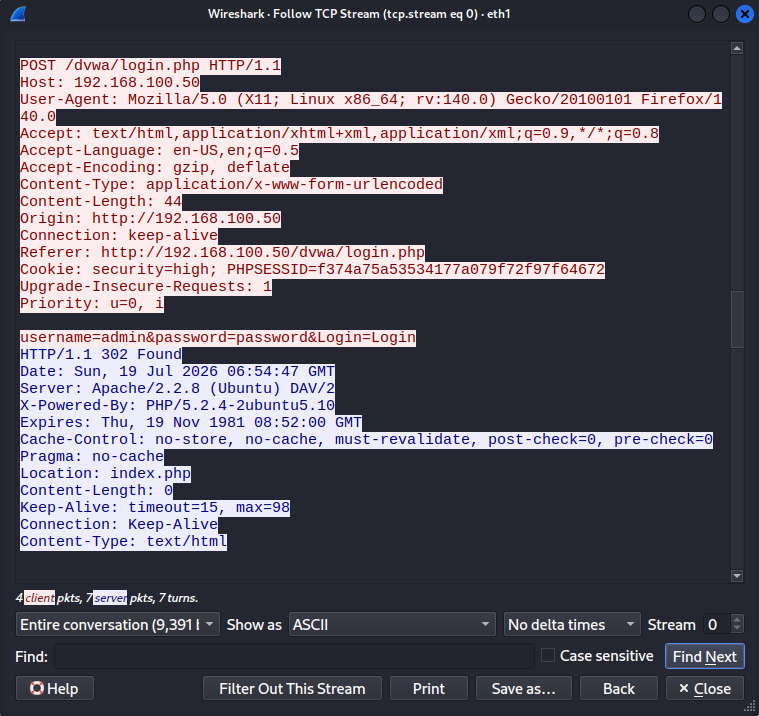
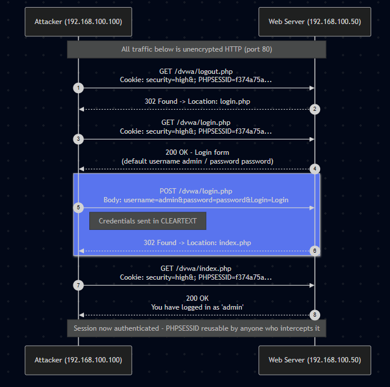

# HTTP Credential Harvesting (MITM) — DVWA on Metasploitable2

**Network Penetration Test Report — Plaintext Credential Interception**

## 1. Engagement Overview
This engagement was performed within an isolated VirtualBox homelab to demonstrate a complete attack chain — from initial host discovery through interception of plaintext authentication credentials on a deliberately vulnerable web application (DVWA, hosted on Metasploitable2).

| | |
|---|---|
| **Attacker host** | Kali Linux — 192.168.100.100 |
| **Target host** | Metasploitable2 (DVWA) — 192.168.100.50 |
| **Network** | VirtualBox internal network — 192.168.100.0/24 |
| **Objective** | Demonstrate the full attack chain from host discovery through interception of plaintext authentication credentials |

## 2. Methodology Summary
- **Network reconnaissance** — identify live hosts on the target subnet
- **Target discovery** — confirm the vulnerable host and its reachability
- **Service enumeration** — identify open ports, running services, and versions
- **Live traffic capture** — capture network traffic during an authentication event
- **Credential interception** — extract plaintext credentials from the captured traffic

## 3. Network Reconnaissance
Connectivity to the target was first confirmed with ICMP, followed by a ping sweep of the full /24 subnet to enumerate live hosts.

*Figure 1 — Connectivity to 192.168.100.50 confirmed via ICMP.*

*Figure 2 — Nmap ping sweep of 192.168.100.0/24 identifies three live hosts, including the target at .50.*

## 4. Target Discovery and Port Scanning
A full TCP port scan of the target was run to identify the complete set of listening services.

*Figure 3 — Full TCP port scan of 192.168.100.50 reveals 28 open ports, indicating a large attack surface.*

## 5. Service Enumeration
Version and service detection was run against the key ports to fingerprint the software stack and identify immediately notable misconfigurations, including anonymous FTP access on vsftpd 2.3.4.

*Figure 4 — Service/version enumeration identifies vsftpd 2.3.4 with anonymous login enabled, OpenSSH 4.7p1, and Apache 2.2.8 hosting the DVWA/Metasploitable2 application.*

## 6. Live Traffic Capture
With the target's HTTP service identified, Wireshark was used to capture live traffic on the attacker interface while an authentication event was triggered against the DVWA login page.

*Figure 5 — Wireshark capture of the TCP stream covering the logout, login page request, and POST login events.*

## 7. Credential Interception
Following the TCP stream isolated the full HTTP request/response cycle for the login POST, revealing the credentials submitted in the clear.

*Figure 6 — Follow TCP Stream output showing the POST body submitted to /dvwa/login.php.*

### Credentials Recovered
The following plaintext credentials were recovered directly from the HTTP POST body, with no decryption or decoding required:
- **Username:** admin
- **Password:** password

The session cookie (`PHPSESSID`) was also observed unencrypted and remained static across the logout, login, and authenticated states — meaning it could be replayed by anyone who intercepted it.

## 8. Traffic Flow Diagram
The full unencrypted request/response flow between the attacker and the web server is mapped below, from the initial logout through to authenticated session access.

*Figure 7 — Sequence diagram of the unencrypted HTTP authentication flow between 192.168.100.100 and 192.168.100.50.*

## 9. Findings and Recommendations

| Finding | Risk | Severity | Recommendation |
|---|---|---|---|
| HTTP used for authentication (no TLS) | Credentials and session cookies transmitted in cleartext, visible to any on-path observer | **Critical** | Enforce HTTPS/TLS site-wide; redirect all HTTP to HTTPS |
| Static, non-rotating session cookie | `PHPSESSID` unchanged across logout/login; token reuse and session hijacking possible if intercepted | **High** | Regenerate session ID on login/privilege change; set Secure and HttpOnly flags |
| Default credentials disclosed on login page | Login form hints at default admin/password combination | **Medium** | Remove hint text; enforce strong password policy |
| Anonymous FTP login allowed | vsftpd 2.3.4 permits anonymous access to the FTP service | **Medium** | Disable anonymous FTP; restrict to authenticated users only |
| Large, exposed attack surface | 28+ ports open including rpcbind, NFS, MySQL, VNC, IRC, and several unknown/legacy services | **High** | Disable unused services; place remaining services behind a firewall and segment the host |

## 10. Conclusion
This engagement successfully demonstrated a complete, low-complexity attack chain against a deliberately vulnerable web application: network reconnaissance identified the target, port and service enumeration mapped a substantial attack surface, and live traffic capture confirmed that authentication credentials and session tokens are transmitted entirely in the clear over HTTP. The single highest-impact remediation is enforcing TLS across all authenticated services, which would independently neutralize the credential and session-hijacking risks identified above.

## Skills Demonstrated
Network reconnaissance (host discovery, ping sweeps), Nmap port scanning and service/version enumeration, Wireshark packet capture and TCP stream analysis, plaintext credential interception via man-in-the-middle traffic analysis, web application security assessment (DVWA), session security analysis, professional penetration test reporting.

## Tools Used
Kali Linux, Nmap (ping sweep, full TCP scan, service/version detection), Wireshark (live capture, Follow TCP Stream), DVWA (Damn Vulnerable Web Application) on Metasploitable2.

*Engagement performed in an isolated, self-owned VirtualBox homelab environment for cybersecurity training and portfolio purposes.*
